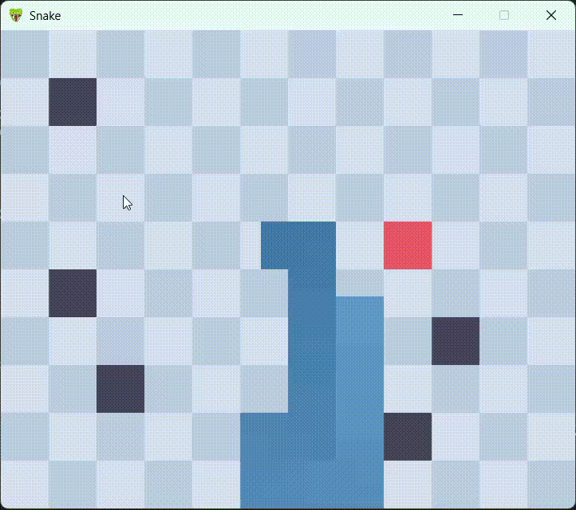
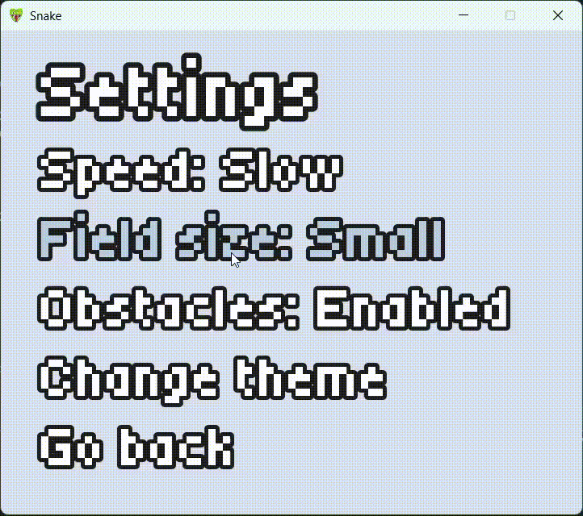
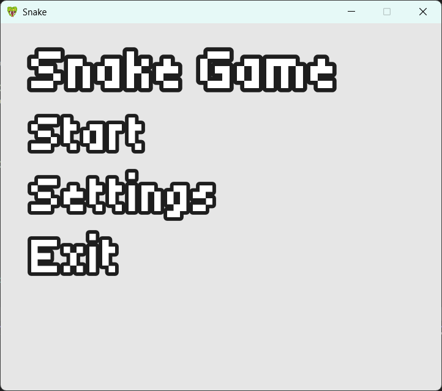
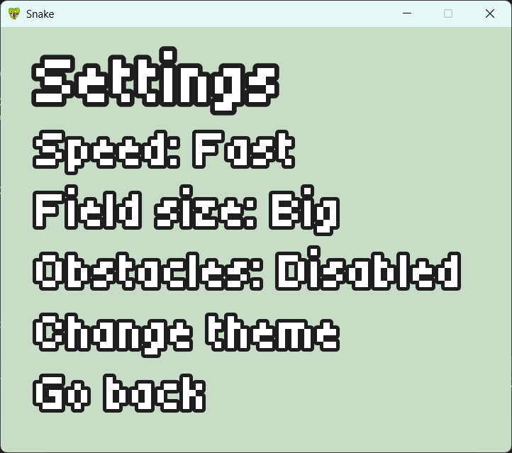
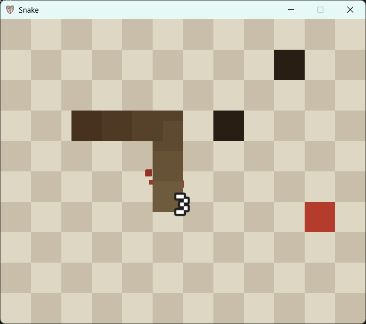

# SnakeGame (SFML 3.0.X)
## Modern C++17 implementation of classic Snake game, lightweight, configurable & portable.

<div align = "center"></div>

## Features
- Standalone executable (No external DLL requirements due to static linking and SFML 3.0.X);
- Embedded directly into binary assets via xxd-generated headers;
- Visual effects made using simple shaders, particle system and more;
- Sound effects which make the exprience more enjoyable;

## Requirements
- CMake 3.16 or higher;
- Compiler with C++17 support;
- ***Linux only*** Core system dependencies required to build SFML 3.0.X;

>[!NOTE]
>Check the list of dependencies on [official SFML website](https://www.sfml-dev.org/tutorials/3.0/getting-started/build-from-source/#installing-dependencies).
>This is not required if you build for Windows, since it uses static libraries.

## Build 
The project uses CMake's `FetchContent`, SFML 3.0.X and its dependencies will be downloaded on build. User needs only to clone the repository.
```bash
git clone https://github.com/Hleblu/Snake-game.git sfmlSnake
```
After cloning repository go inside the project folder and start the CMake build process.
```bash
cmake -B build -DCMAKE_BUILD_TYPE=Release
```
Compile the executable.
```bash
cmake --build build --config Release
```
Compiled executable will be located in <ins>build/Release<ins> directory. Enjoy!

## Preview
<div align="center">
	
	
	<br><br>
	
	
	<br><br>
	
	
</div>

## Important notes
- **Learning project:** This project was developed primarily for learning C++ and SFML.
- **Broken Commit History:** Please do not build commits prior to `[0944915]`. To release this repository publicly, all originally assets were scraped and replaced with CC0 alternatives (which I found better). Therefore older commits miss the resources and won't compile.