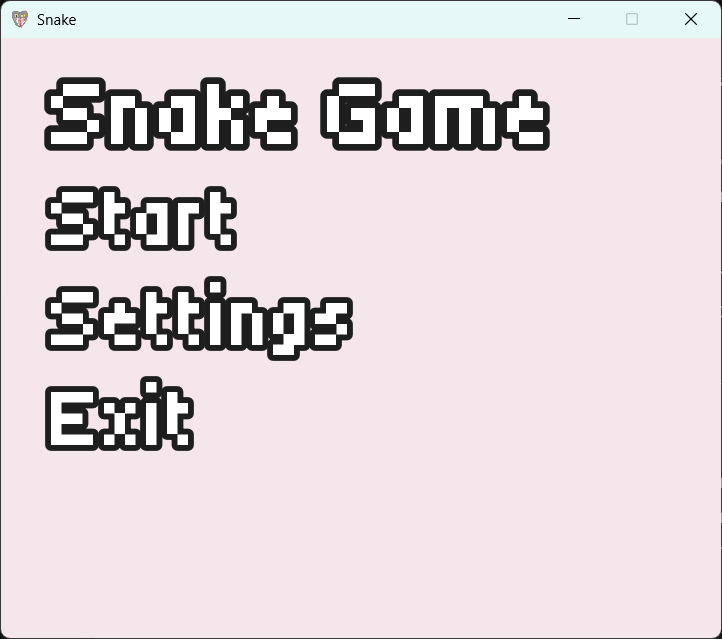
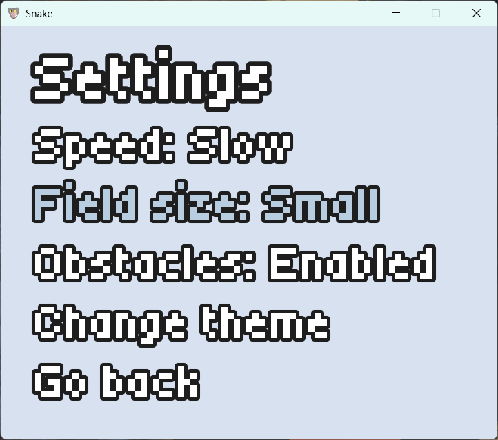
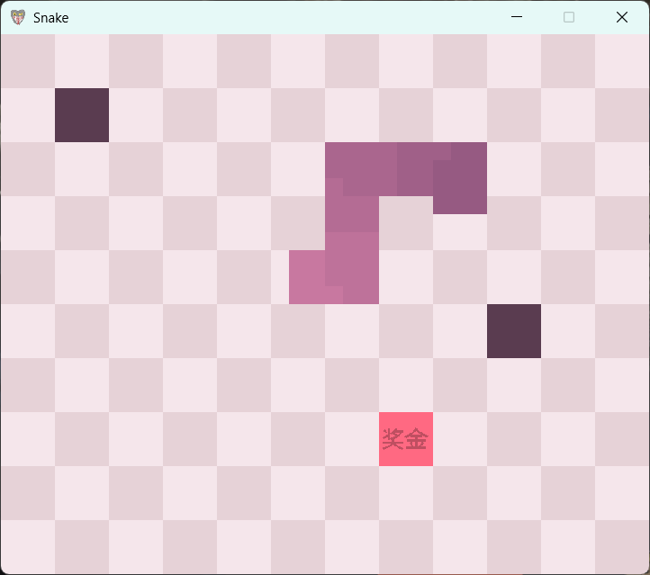

# SnakeGame (SFML 3.X)
## Modern C++17 implementation of classic Snake game, lightweight, configurable & portable.

## Features
- Standalone executable (No external DLL requirements due to static linking and SFML 3.X);
- Embedded w/ xxd headers assets;
- Visual effects made using simple shaders;

## Requirements
- SFML 3.0 or higher with compiled static libraries;
- CMake 3.16 or higher;
- C++ 17 compiler;

## Build (VS2022 example)
1. Open the project as a folder in VS2022;
2. Point the SFML_DIR variable to your SFML installation;
3. Select the x64-Release configuration in the toolbar;
4. Go to <ins>Build</ins> > <ins>Build all</ins>;
5. You will find the executable at <ins>out</ins> > <ins>build</ins> > <ins>x64-Release</ins>

## Screenshots
### Main menu

### Config menu

### Game field

